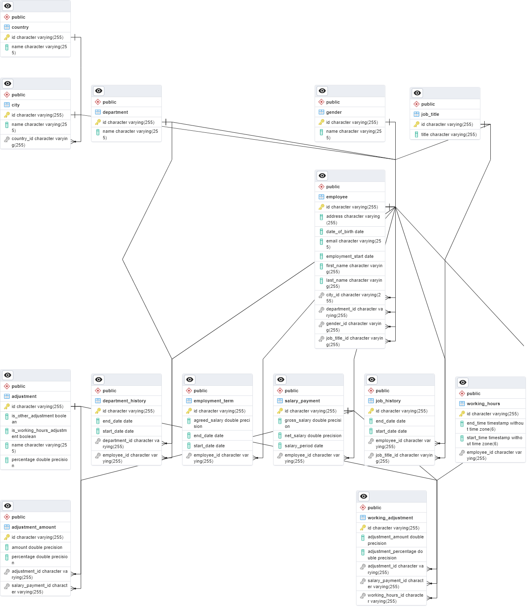

# Employee Payroll System

## Description

This is a simple employee payroll system that allows you to manage employees, their salaries, working hours, and other
adjustments.

## Getting Started

### Prerequisites

* Java 17
* Kotlin
* Maven
* Postgres SQL

### Installing

* Clone the repository
* Open the project in your favorite IDE
* Run `mvn clean install` to build the project
* Create a database named `Employee` in Postgres
